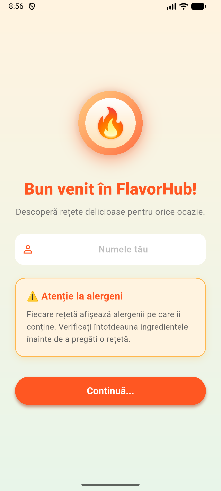
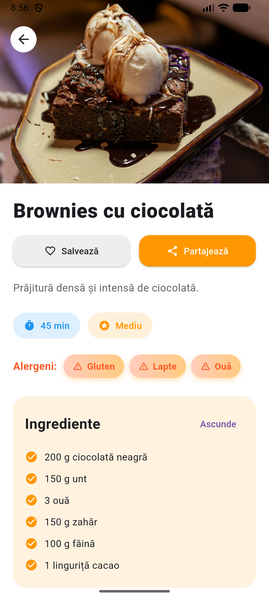

# 🔥 FlavorHub - Your Culinary Companion

<div align="center">
  
  **Descoperă, salvează și pregătește rețete delicioase cu FlavorHub!**
  
  [](https://flutter.dev)
  [](https://dart.dev)
  [](LICENSE)
  [](https://github.com/MosutLarisa/flavor_hub)
</div>

---

## 📖 Despre Proiect

**FlavorHub** este o aplicație mobilă Flutter care te ajută să explorezi și să organizezi rețete culinare. Fie că îți dorești un desert dulce sau o mâncare sărată, FlavorHub îți oferă o colecție variată de rețete cu instrucțiuni detaliate, informații pe alergeni și posibilitatea de a salva favoritele tale.

### 🎯 Problemă Rezolvată

Mulți oameni:
- ❌ Pierd timpul căutând rețete pe internet
- ❌ Nu își pot organiza rețetele preferate într-un loc
- ❌ Nu știu ce alergeni conține o rețetă înainte de a o pregăti


**FlavorHub rezolvă toate acestea** oferind o platformă simplă, offline și organizată — cu filtru de dificultate, alergeni afișați clar și sistem de favorite.

---

## ✨ Funcționalități Principale

### 👋 **Ecran de Pornire Personalizat**
- Introducere prietenoasă în aplicație
- Navigare ușoară către rețetele dulci sau sărate  


### ⚠️ **Sistem de Alergeni**
- Fiecare rețetă afișează alergenii pe care îi conține
- Informații utile pentru persoanele cu restricții alimentare

### 🔍 **Căutare și Filtrare**
- Caută rețete după nume în timp real
- Filtrare după dificultate: Ușor, Mediu, Dificil

### ❤️ **Sistem de Favorite**
- Salvează rețetele preferate cu un singur tap
- Acces rapid la colecția personală


### 📤 **Partajare Rețete**
- Partajează rețeta completă, ingredientele sau pașii de preparare
- Compatibil cu WhatsApp, Email și alte apps


---

## 🎨 Capturi de Ecran

<div align="center">
  
  
  
</div>


---

## 🚀 Cum Rulezi Proiectul

### Cerințe

- Flutter SDK >= 3.5.0
- Dart SDK >= 3.0.0
- Android Studio sau VS Code cu extensia Flutter
- Un emulator Android sau un telefon fizic conectat

### Pași

1. **Clonează repository-ul:**
```bash
git clone https://github.com/MosutLarisa/flavor_hub.git
cd flavor_hub
```

2. **Instalează dependențele:**
```bash
flutter pub get
```

3. **Rulează aplicația:**
```bash
flutter run
```


---

## 📦 Dependențe

| Pachet | Descriere |
|--------|-----------|
| `shared_preferences` | Salvare locală a favoritelor pe dispozitiv |
| `share_plus` | Partajarea rețetelor prin apps externe (WhatsApp, Email, etc.) |

---

## 🏗️ Structura Proiectului

```
lib/
├── common/
│   └── strings.dart                # Toate textele din app
├── data/
│   └── recipe_data.dart           # Lista de rețete
├── models/
│   └── recipe.dart                # Modele de date
├── providers/
│   └── favorites_provider.dart    # Manager favorite (Singleton)
├── screens/
│   ├── intro_screen.dart          # Pagina de pornire
│   ├── welcome_screen.dart        # Meniu principal
│   ├── sweet_recipes_screen.dart  # Rețete dulci
│   ├── savory_recipes_screen.dart # Rețete sărate
│   ├── favorites_screen.dart      # Favorite
│   └── recipe_detail_screen.dart  # Detalii rețetă
├── utils/
│   ├── navigation_helper.dart     # Helper navigare
│   ├── difficulty_helper.dart     # Helper dificultăți
│   └── share_helper.dart          # Helper partajare
├── widgets/
│   ├── allergens_widget.dart      # Widget alergeni
│   ├── app_logo.dart              # Logo aplicație
│   ├── recipe_card.dart           # Card rețetă
│   ├── recipe_image_header.dart   # Header imagine
│   ├── recipe_details_section.dart# Detalii complete
│   ├── recipe_list_widget.dart    # Listă rețete
│   ├── search_bar_widget.dart     # Bară căutare
│   └── difficulty_filter_widget.dart # Filtru dificultate
└── main.dart
```

---

## 👨‍💻 Autor

**Mosut Larisa**
- GitHub: [@MosutLarisa](https://github.com/MosutLarisa)

---

<div align="center">
  <strong>Făcut cu Flutter 🔥</strong>
</div>